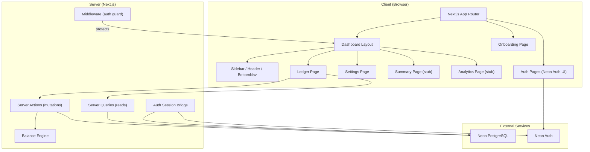
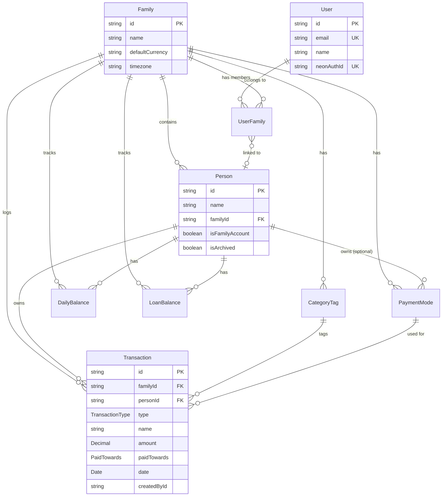

# Architecture — SpendBook

> **Last verified**: 2026-05-05 — based on commit `5721da7`

---

## System Overview

A **full-stack Next.js 15** family expense tracker deployed on Vercel, using PostgreSQL (Neon) for storage, Prisma for ORM, Neon Auth for authentication, and Tailwind CSS v4 + shadcn/ui for the frontend.



---

## Directory Structure

```
spendBook/
├── .github/copilot-instructions.md   # AI coding guidelines
├── docs/                              # Project documentation (PRD, memory, journal, etc.)
├── prisma/
│   ├── schema.prisma                  # Database schema (10 models)
│   ├── seed.ts                        # Demo data seeder
│   └── migrations/                    # Prisma migrations
├── src/
│   ├── app/                           # Next.js App Router
│   │   ├── layout.tsx                 # Root layout (NeonAuthUIProvider, Inter font, Toaster)
│   │   ├── page.tsx                   # Root redirect → /ledger
│   │   ├── globals.css                # Tailwind v4 + CSS vars (light/dark)
│   │   ├── (dashboard)/               # Protected route group
│   │   │   ├── layout.tsx             # Auth/onboarding guard + Sidebar/Header/BottomNav
│   │   │   ├── ledger/page.tsx        # Daily ledger (main view)
│   │   │   ├── settings/page.tsx      # Person management
│   │   │   ├── summary/page.tsx       # Placeholder (Phase 2)
│   │   │   └── analytics/page.tsx     # Placeholder (Phase 3)
│   │   ├── onboarding/page.tsx        # Family setup for new users
│   │   ├── auth/[path]/page.tsx       # Neon Auth sign-in/sign-up UI
│   │   ├── account/[path]/page.tsx    # Neon Auth account settings UI
│   │   └── api/auth/[...path]/route.ts # Neon Auth API handler
│   ├── components/
│   │   ├── layout/                    # Sidebar, Header, BottomNav
│   │   ├── ledger/                    # BalanceCard, DateNav, LedgerAddButton, TransactionGroup
│   │   ├── transaction/               # TransactionForm, TransactionCard
│   │   ├── settings/                  # PersonList
│   │   └── ui/                        # shadcn/ui primitives (9 components)
│   ├── config/constants.ts            # Labels, default tags, nav items
│   ├── generated/prisma/             # Prisma generated client (output dir)
│   ├── hooks/                         # Custom hooks (empty)
│   ├── lib/
│   │   ├── auth/                      # server.ts, client.ts, session.ts
│   │   ├── db.ts                      # Prisma singleton
│   │   ├── utils.ts                   # cn(), format helpers, date utils
│   │   ├── validators.ts             # Zod schemas
│   │   └── balance.ts                 # Balance/loan calculation engine
│   ├── server/
│   │   ├── actions/                   # Server Actions: onboarding, person, transaction
│   │   └── queries/                   # Server Queries: ledger, settings
│   ├── types/index.ts                 # Re-exports Prisma types + custom types
│   └── middleware.ts                  # Neon Auth middleware
├── tests/                             # Test directories (all empty)
├── public/                            # PWA manifest, icons
└── [config files]                     # package.json, tsconfig, vite, playwright, eslint, etc.
```

---

## Data Model



### Key Design Decisions:

- **Family Account** is a special `Person` with `isFamilyAccount: true` — acts as the joint/household account
- **Payment Mode ownership** determines loan impact: `ownerPersonId = null` means family-owned
- **DailyBalance + LoanBalance** are cached computations, derived from transactions; can be fully recalculated
- **Soft deletes** for persons (`isArchived: true`), category tags, and payment modes

---

## Key Data Flows

### Authentication Flow

```
Browser → /auth/sign-in (Neon Auth UI)
  → Neon Auth handles credentials/OAuth
  → Sets auth cookie
  → Middleware checks cookie on each request
  → Dashboard layout calls getAppSession():
    1. auth.getSession() → Neon Auth session
    2. Find/create internal User by email
    3. Find UserFamily → get activeFamilyId + role
    4. If no family → redirect to /onboarding
```

### Transaction Creation Flow

```
User fills TransactionForm → formAction (useActionState)
  → createTransactionAction (server action):
    1. getAppSession() → verify auth
    2. Zod validation
    3. Verify person belongs to family
    4. db.$transaction → create transaction
    5. recalculateBalancesForDate():
       a. Fetch all transactions for person+date
       b. Sum debits/credits/payments → upsert DailyBalance
       c. For non-family persons: compute loan deltas → upsert LoanBalance
    6. revalidatePath("/ledger")
```

### Loan Impact Matrix

```
| Payment Mode Owner | Paid Towards | Loan Effect              |
|--------------------|--------------|--------------------------|
| Family mode        | Personal     | +Loan (person owes more) |
| Family mode        | Family       | No change                |
| Person's own mode  | Personal     | No change (stats only)   |
| Person's own mode  | Family       | −Loan (repayment)        |
| Any mode           | PAYMENT type | −Loan (always reduces)   |
| Any mode           | CREDIT+Personal | −Loan (refund)        |
```

---

## Build & Development

| Tool             | Version | Role                        |
| ---------------- | ------- | --------------------------- |
| **Next.js**      | 15.5.12 | Full-stack framework        |
| **React**        | 19.0.0  | UI library                  |
| **TypeScript**   | 5.7.3   | Type safety                 |
| **Prisma**       | 6.4.1   | ORM + migrations            |
| **pnpm**         | 10.30.3 | Package manager             |
| **Tailwind CSS** | 4.0.9   | Styling (with PostCSS)      |
| **ESLint**       | 9.0.0   | Linting                     |
| **Prettier**     | 3.4.2   | Formatting                  |
| **Vitest**       | 3.0.5   | Unit testing (not yet used) |
| **Playwright**   | 1.50.1  | E2E testing (not yet used)  |
| **Husky**        | 9.1.7   | Git hooks                   |
| **lint-staged**  | 15.4.3  | Pre-commit formatting       |

### Scripts

```bash
pnpm dev          # Start dev server
pnpm build        # prisma generate + migrate deploy + next build
pnpm db:migrate   # prisma migrate dev
pnpm db:studio    # Open Prisma Studio
pnpm db:seed      # Seed demo data
pnpm lint         # ESLint
pnpm format       # Prettier
pnpm type-check   # TypeScript noEmit check
pnpm test         # Vitest (no tests yet)
pnpm test:e2e     # Playwright (no tests yet)
```

---

## Deployment

- **Platform**: Vercel
- **Database**: Neon PostgreSQL (ap-southeast-1)
- **Auth**: Neon Auth (integrated with Neon project)
- **Config**: `vercel.json` specifies pnpm build/install commands
- **Domain**: spendbook.adityanvs.in (per memory.md)

### Required Environment Variables (Vercel)

| Variable                  | Source                                    |
| ------------------------- | ----------------------------------------- |
| `DATABASE_URL`            | Neon Console → Connection string (pooler) |
| `NEON_AUTH_BASE_URL`      | Neon Console → Auth → Configuration       |
| `NEON_AUTH_COOKIE_SECRET` | `openssl rand -base64 32`                 |

---

## Styling Architecture

- **Tailwind CSS v4** with PostCSS (not CDN)
- **CSS custom properties** for theming (light + dark mode)
- **shadcn/ui** components using `class-variance-authority` + `tailwind-merge`
- **Domain colors**: `debit` (red), `credit` (green), `payment` (blue) — each with foreground and muted variants
- **Neon Auth UI** styles imported via `@import "@neondatabase/auth/ui/tailwind"`
- **Inter** font from Google Fonts
