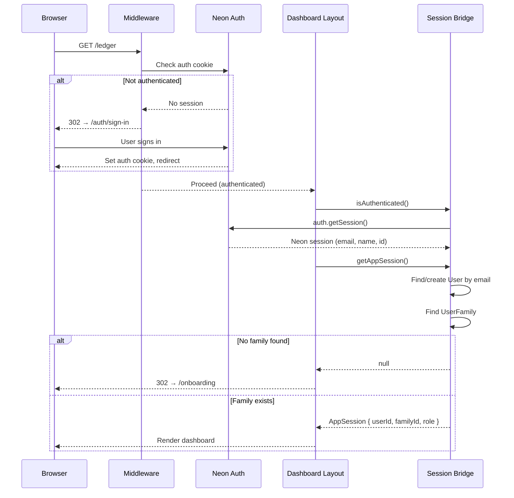
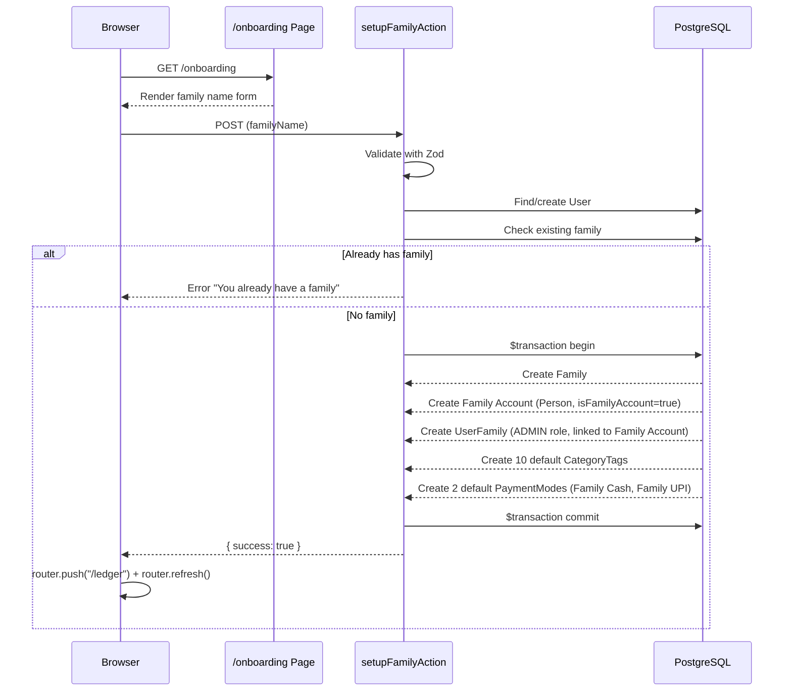
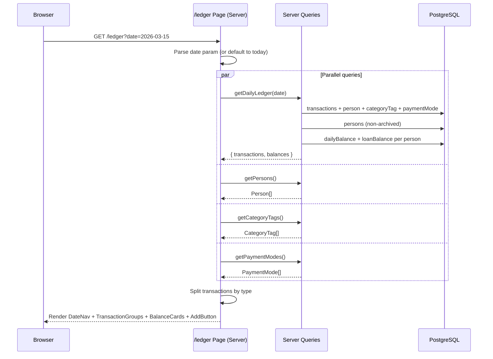
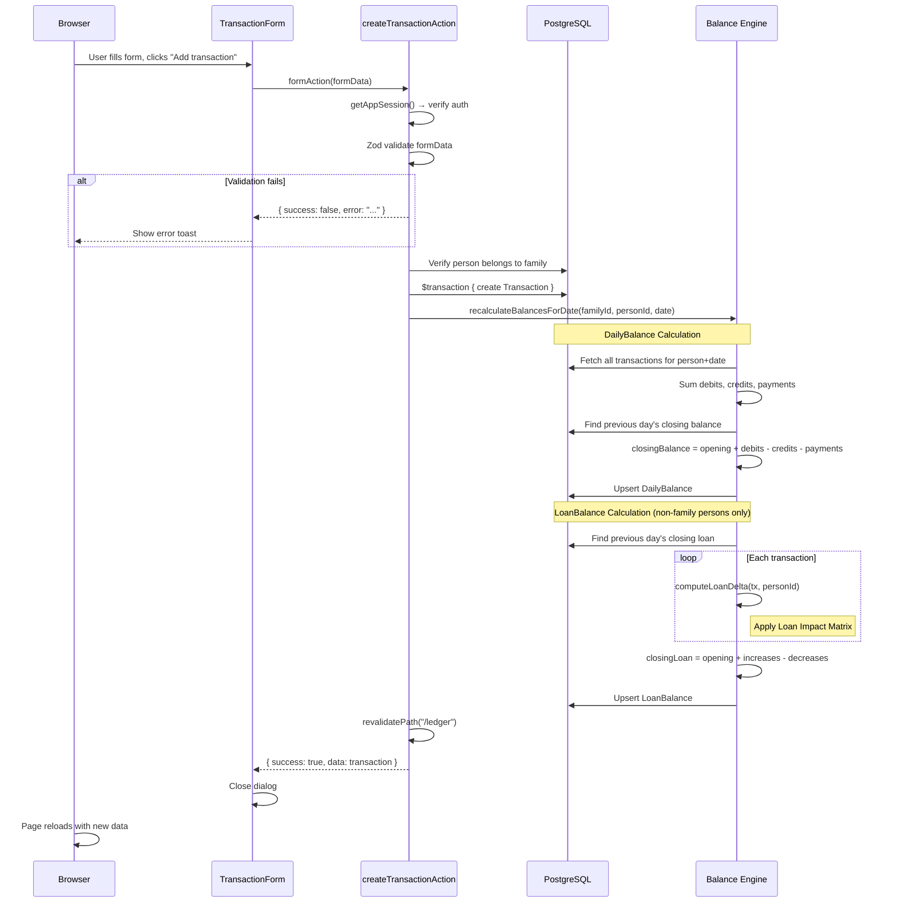
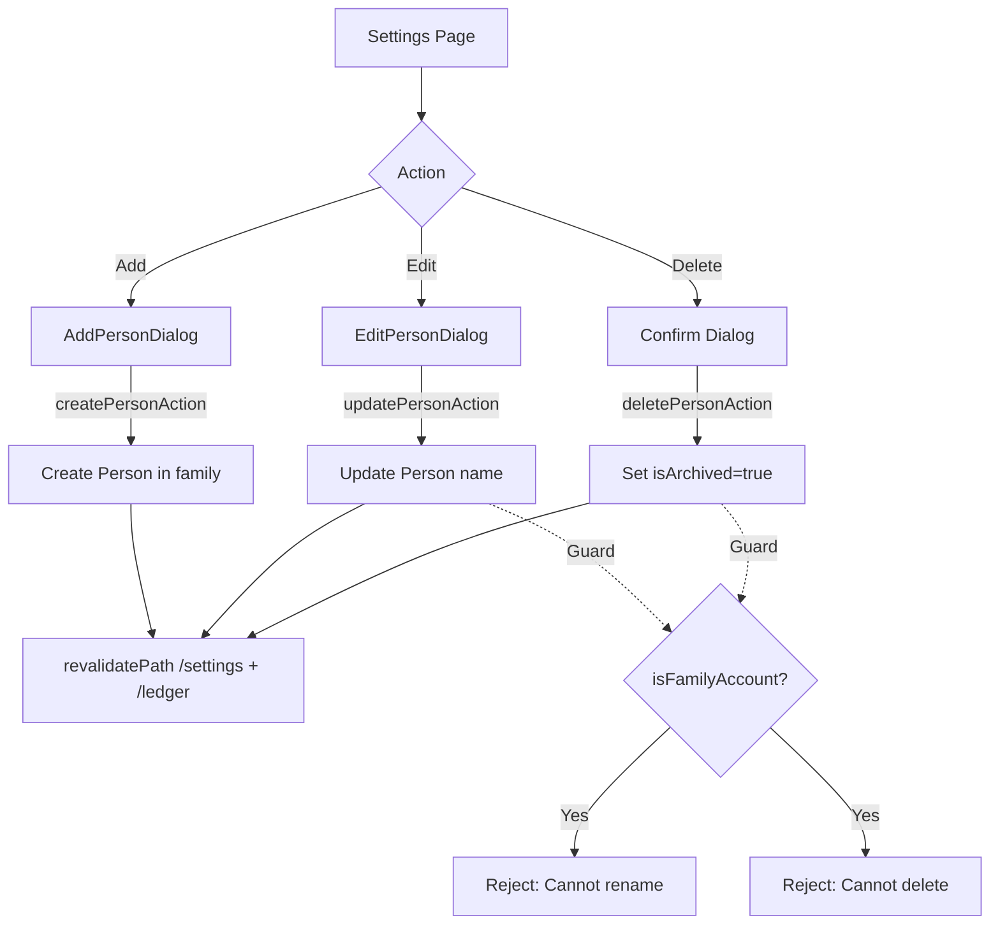
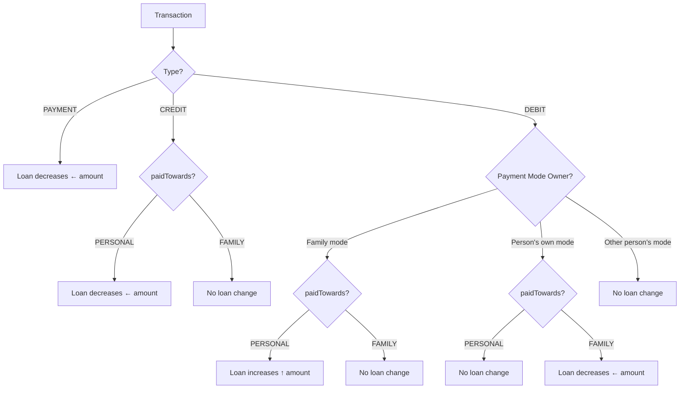

# Flows — SpendBook

> **Last verified**: 2026-05-05 — based on commit `5721da7`

---

## 1. Authentication Flow



### Key Details:

- **Middleware** ([middleware.ts](file:///C:/Users/nadam/Coding/Web%20Projects/spendBook/src/middleware.ts)) runs on every non-excluded route
- **Neon Auth** handles all credential storage, OAuth, and session tokens externally
- **Session bridging** ([session.ts](file:///C:/Users/nadam/Coding/Web%20Projects/spendBook/src/lib/auth/session.ts)) maps external identity to internal User/Family model
- **User auto-creation**: If a Neon Auth user has no internal User record, one is created on first session check

---

## 2. Onboarding Flow



### Default Data Seeded:

- **Family Account** — built-in Person that represents the household
- **10 Category Tags** — Food Delivery, Groceries, Shopping, Subscriptions, Utilities, Transport, Entertainment, Healthcare, Education, Miscellaneous
- **2 Payment Modes** — Family Cash, Family UPI (both family-owned)

---

## 3. Daily Ledger Load Flow



---

## 4. Transaction Creation Flow



---

## 5. Transaction Update Flow

Same as creation, with these differences:

1. Finds existing transaction, verifies it belongs to the family
2. Updates the transaction record
3. Recalculates balances for the **new date**
4. If the date changed, also recalculates for the **old date** (to correct the previous day's balance)

---

## 6. Transaction Deletion Flow

```
deleteTransactionAction(id)
  → getAppSession()
  → Find transaction in family
  → db.transaction.delete()
  → recalculateBalancesForDate(familyId, personId, date)
  → revalidatePath("/ledger")
```

---

## 7. Person Management Flow



### Role enforcement:

- All person mutations require `ADMIN` role
- Family Account cannot be renamed or deleted
- "Delete" is a soft archive — transactions are preserved

---

## 8. Balance Engine Logic

### Loan Impact Matrix Decision Tree



### DailyBalance formula:

```
closingBalance = openingBalance + totalDebits - totalCredits - totalPayments
```

where `openingBalance` = previous day's `closingBalance` (or 0 if first day).

### LoanBalance formula:

```
closingLoan = openingLoan + loanIncreases - loanDecreases
```

> [!IMPORTANT]
> Balances are **cached computations**. They are recalculated from transactions on every mutation. This means balance records for dates **after** a modified date may become stale. Currently, only the **exact date** of the mutation is recalculated — cascading future recalculation is not implemented.

---

## 9. Request Lifecycle

```
Browser Request
  │
  ├─ Static assets (.css, .js, images)
  │   └→ Served directly by Next.js / Vercel CDN
  │
  ├─ /api/auth/*
  │   └→ Neon Auth handler (GET, POST)
  │
  └─ All other routes
      └→ Middleware (auth.middleware)
          ├─ No cookie → 302 /auth/sign-in
          └─ Valid cookie → Continue
              └→ Route handler
                  ├─ (dashboard) layout
                  │   ├─ isAuthenticated() → false → 302 /auth/sign-in
                  │   ├─ getAppSession() → null → 302 /onboarding
                  │   └─ Session valid → Render page
                  └─ Other pages (onboarding, auth) → Render directly
```
