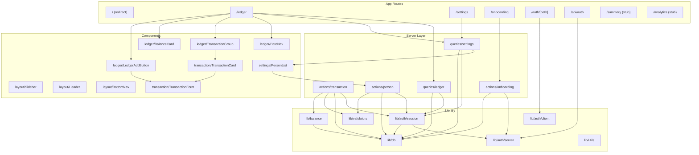

# Modules — SpendBook

> **Last verified**: 2026-05-05 — based on commit `5721da7`

---

## Module Dependency Map

---

## App Routes

### `/` — Root Page

[page.tsx](file:///C:/Users/nadam/Coding/Web%20Projects/spendBook/src/app/page.tsx)

Simple redirect to `/ledger`. Middleware handles unauthenticated users.

---

### `/(dashboard)/ledger` — Daily Ledger (Main View)

[page.tsx](<file:///C:/Users/nadam/Coding/Web%20Projects/spendBook/src/app/(dashboard)/ledger/page.tsx>)

| Aspect  | Detail                                                                                                |
| ------- | ----------------------------------------------------------------------------------------------------- |
| Type    | Server Component                                                                                      |
| Data    | `getDailyLedger(date)`, `getPersons()`, `getCategoryTags()`, `getPaymentModes()`                      |
| Props   | `searchParams.date` (YYYY-MM-DD, defaults to today)                                                   |
| Renders | `DateNav`, `TransactionGroup` × 3 (DEBIT/CREDIT/PAYMENT), `BalanceCard` per person, `LedgerAddButton` |
| Exports | `dynamic = "force-dynamic"`                                                                           |

---

### `/(dashboard)/settings` — Person Management

[page.tsx](<file:///C:/Users/nadam/Coding/Web%20Projects/spendBook/src/app/(dashboard)/settings/page.tsx>)

Server component that fetches persons via `getPersons()` and renders `PersonList`.

> [!NOTE]
> Only person CRUD is implemented. Category tag and payment mode management (planned per PRD) are **not yet built**.

---

### `/(dashboard)/summary` & `/(dashboard)/analytics` — Stubs

Placeholder pages displaying "coming in Phase 2/3" messages.

---

### `/onboarding` — Family Setup

[page.tsx](file:///C:/Users/nadam/Coding/Web%20Projects/spendBook/src/app/onboarding/page.tsx)

| Aspect | Detail                                                                                                  |
| ------ | ------------------------------------------------------------------------------------------------------- |
| Type   | Client Component (`"use client"`)                                                                       |
| Action | `setupFamilyAction` via `useActionState`                                                                |
| Flow   | User enters family name → creates Family + Family Account + default tags/modes → redirects to `/ledger` |
| Guard  | Dashboard layout redirects here if `getAppSession()` returns null                                       |

---

### `/auth/[path]` — Auth UI

Renders Neon Auth's `<AuthView>` component. Handles sign-in, sign-up, forgot password.

### `/account/[path]` — Account Settings

Renders Neon Auth's `<AccountView>` component. Handles profile, password changes.

### `/api/auth/[...path]` — Auth API

Delegates to `auth.handler()` for GET and POST requests. Handles auth callbacks.

---

## Server Actions

### `actions/transaction.ts`

[transaction.ts](file:///C:/Users/nadam/Coding/Web%20Projects/spendBook/src/server/actions/transaction.ts)

| Action                    | Signature                                      | Auth     | Validation                | Side Effects                                                          |
| ------------------------- | ---------------------------------------------- | -------- | ------------------------- | --------------------------------------------------------------------- |
| `createTransactionAction` | `(prev, formData) → ActionResult<Transaction>` | Required | `createTransactionSchema` | Creates transaction, recalculates balances, revalidates `/ledger`     |
| `updateTransactionAction` | `(prev, formData) → ActionResult<Transaction>` | Required | `updateTransactionSchema` | Updates transaction, recalculates balances for both old and new dates |
| `deleteTransactionAction` | `(id) → ActionResult<void>`                    | Required | `deleteTransactionSchema` | Deletes transaction, recalculates balances                            |

**Pattern**: All actions verify the person/transaction belongs to the user's active family.

> [!WARNING]
> `recalculateBalancesForDate()` runs **outside** the Prisma `$transaction` to avoid deadlocks. This means there's a brief window where balances could be stale if concurrent mutations happen.

---

### `actions/person.ts`

[person.ts](file:///C:/Users/nadam/Coding/Web%20Projects/spendBook/src/server/actions/person.ts)

| Action               | Auth     | Role Check | Notes                                                                |
| -------------------- | -------- | ---------- | -------------------------------------------------------------------- |
| `createPersonAction` | Required | ADMIN only | Creates person in active family                                      |
| `updatePersonAction` | Required | ADMIN only | Cannot rename Family Account                                         |
| `deletePersonAction` | Required | ADMIN only | Soft delete (sets `isArchived: true`). Cannot delete Family Account. |

---

### `actions/onboarding.ts`

[onboarding.ts](file:///C:/Users/nadam/Coding/Web%20Projects/spendBook/src/server/actions/onboarding.ts)

Creates the full family setup atomically:

1. Find/create internal User
2. Check no existing family
3. `$transaction`: Create Family → Create Family Account (Person) → Link user as ADMIN → Seed default CategoryTags → Seed default PaymentModes

---

## Server Queries

### `queries/ledger.ts`

[ledger.ts](file:///C:/Users/nadam/Coding/Web%20Projects/spendBook/src/server/queries/ledger.ts)

`getDailyLedger(date)` returns:

- All transactions for the family on that date (with person, categoryTag, paymentMode relations)
- Balance summaries for each non-archived person (opening/closing balance + loan balance)

### `queries/settings.ts`

[settings.ts](file:///C:/Users/nadam/Coding/Web%20Projects/spendBook/src/server/queries/settings.ts)

- `getPersons()` — active persons, Family Account first
- `getCategoryTags()` — active tags ordered by sortOrder
- `getPaymentModes()` — active modes with ownerPerson relation

---

## Library Modules

### `lib/auth/server.ts`

[server.ts](file:///C:/Users/nadam/Coding/Web%20Projects/spendBook/src/lib/auth/server.ts)

Creates the Neon Auth server instance. **Throws immediately** if `NEON_AUTH_BASE_URL` or `NEON_AUTH_COOKIE_SECRET` are missing.

### `lib/auth/client.ts`

[client.ts](file:///C:/Users/nadam/Coding/Web%20Projects/spendBook/src/lib/auth/client.ts)

Creates the Neon Auth client for browser-side components. One-liner.

### `lib/auth/session.ts`

[session.ts](file:///C:/Users/nadam/Coding/Web%20Projects/spendBook/src/lib/auth/session.ts)

**Critical bridge module** between Neon Auth and the app's data model.

| Function                   | Returns              | Purpose                                                                                               |
| -------------------------- | -------------------- | ----------------------------------------------------------------------------------------------------- |
| `getAppSession()`          | `AppSession \| null` | Maps Neon Auth user → internal User → first UserFamily → session with `activeFamilyId` + `activeRole` |
| `hasCompletedOnboarding()` | `boolean`            | Checks if user has a family (used by redirects)                                                       |
| `isAuthenticated()`        | `boolean`            | Checks if Neon Auth session exists (regardless of onboarding)                                         |

### `lib/db.ts`

[db.ts](file:///C:/Users/nadam/Coding/Web%20Projects/spendBook/src/lib/db.ts)

Prisma Client singleton. Caches on `globalThis` in dev to survive hot reload. Logs errors + warnings in dev, errors only in prod.

### `lib/utils.ts`

[utils.ts](file:///C:/Users/nadam/Coding/Web%20Projects/spendBook/src/lib/utils.ts)

| Function                                     | Purpose                                               |
| -------------------------------------------- | ----------------------------------------------------- |
| `cn(...inputs)`                              | Merges Tailwind classes via `clsx` + `tailwind-merge` |
| `formatCurrency(amount, currency?, locale?)` | Formats as Indian Rupees (₹)                          |
| `formatDate(date)`                           | "Mon, 3 Mar 2026" format                              |
| `toDateParam(date)`                          | `YYYY-MM-DD` string                                   |
| `fromDateParam(param)`                       | Parse `YYYY-MM-DD` → Date at midnight UTC             |
| `today()`                                    | Today's date at midnight UTC                          |
| `addDays(date, days)`                        | Date arithmetic                                       |

### `lib/validators.ts`

[validators.ts](file:///C:/Users/nadam/Coding/Web%20Projects/spendBook/src/lib/validators.ts)

Zod schemas for all mutations:

- `createPersonSchema` / `updatePersonSchema`
- `createTransactionSchema` / `updateTransactionSchema` / `deleteTransactionSchema`
- `createCategoryTagSchema` / `createPaymentModeSchema` (⚠️ schemas exist but no actions use them)

### `lib/balance.ts`

[balance.ts](file:///C:/Users/nadam/Coding/Web%20Projects/spendBook/src/lib/balance.ts)

| Function                                               | Purpose                                                                         |
| ------------------------------------------------------ | ------------------------------------------------------------------------------- |
| `computeLoanDelta(tx, personId)`                       | Returns `Decimal` loan change for a transaction based on the Loan Impact Matrix |
| `recalculateBalancesForDate(familyId, personId, date)` | Recomputes and upserts DailyBalance + LoanBalance for a person on a date        |
| `recalculateAllBalancesForDate(familyId, date)`        | Recalculates for ALL non-archived persons (currently unused)                    |

---

## Components

### Layout Components

| Component                                                                                               | Type   | Purpose                                                                               |
| ------------------------------------------------------------------------------------------------------- | ------ | ------------------------------------------------------------------------------------- |
| [Sidebar](file:///C:/Users/nadam/Coding/Web%20Projects/spendBook/src/components/layout/Sidebar.tsx)     | Client | Desktop nav (hidden on mobile). 4 nav items + logo. Active state via `usePathname()`. |
| [Header](file:///C:/Users/nadam/Coding/Web%20Projects/spendBook/src/components/layout/Header.tsx)       | Server | Top bar. Shows logo on mobile, user name + `UserButton` on all.                       |
| [BottomNav](file:///C:/Users/nadam/Coding/Web%20Projects/spendBook/src/components/layout/BottomNav.tsx) | Client | Mobile bottom tab bar (hidden on md+). Same 4 nav items.                              |

### Ledger Components

| Component                                                                                                             | Type   | Purpose                                                                   |
| --------------------------------------------------------------------------------------------------------------------- | ------ | ------------------------------------------------------------------------- |
| [DateNav](file:///C:/Users/nadam/Coding/Web%20Projects/spendBook/src/components/ledger/DateNav.tsx)                   | Client | Previous/next day arrows, formatted date, "Today" badge                   |
| [TransactionGroup](file:///C:/Users/nadam/Coding/Web%20Projects/spendBook/src/components/ledger/TransactionGroup.tsx) | Server | Section for DEBIT/CREDIT/PAYMENT with color-coded header and total        |
| [BalanceCard](file:///C:/Users/nadam/Coding/Web%20Projects/spendBook/src/components/ledger/BalanceCard.tsx)           | Server | Per-person card: opening/closing balance + debits/credits/payments + loan |
| [LedgerAddButton](file:///C:/Users/nadam/Coding/Web%20Projects/spendBook/src/components/ledger/LedgerAddButton.tsx)   | Client | FAB on mobile, inline button on desktop. Opens TransactionForm.           |

### Transaction Components

| Component                                                                                                                | Type   | Purpose                                                                    |
| ------------------------------------------------------------------------------------------------------------------------ | ------ | -------------------------------------------------------------------------- |
| [TransactionForm](file:///C:/Users/nadam/Coding/Web%20Projects/spendBook/src/components/transaction/TransactionForm.tsx) | Client | Dialog form for add/edit. Uses `useActionState` for create/update.         |
| [TransactionCard](file:///C:/Users/nadam/Coding/Web%20Projects/spendBook/src/components/transaction/TransactionCard.tsx) | Client | Single transaction row: name, category badge, amount, edit/delete buttons. |

### Settings Components

| Component                                                                                                   | Type   | Purpose                                                                                                        |
| ----------------------------------------------------------------------------------------------------------- | ------ | -------------------------------------------------------------------------------------------------------------- |
| [PersonList](file:///C:/Users/nadam/Coding/Web%20Projects/spendBook/src/components/settings/PersonList.tsx) | Client | List of family members with add/edit/delete. Contains `AddPersonDialog` and `EditPersonDialog` sub-components. |

### UI Primitives (shadcn/ui)

`badge`, `button`, `card`, `dialog`, `input`, `label`, `select`, `separator`, `textarea`

---

## Configuration

### `config/constants.ts`

[constants.ts](file:///C:/Users/nadam/Coding/Web%20Projects/spendBook/src/config/constants.ts)

- Label maps: `TRANSACTION_TYPE_LABELS`, `PAID_TOWARDS_LABELS`, `PAYMENT_MODE_TYPE_LABELS`, `ROLE_LABELS`
- `DEFAULT_CATEGORY_TAGS` — 10 predefined categories with colors
- `DEFAULT_CURRENCY` = "INR", `DEFAULT_TIMEZONE` = "Asia/Kolkata"
- `NAV_ITEMS` — 4 nav items (duplicated in Sidebar/BottomNav directly)

> [!NOTE]
> `NAV_ITEMS` in constants.ts uses string icon names (`"BookOpen"`), but `Sidebar.tsx` and `BottomNav.tsx` define their own nav items with actual Lucide icon imports. The constants version is **unused**.

### `types/index.ts`

[index.ts](file:///C:/Users/nadam/Coding/Web%20Projects/spendBook/src/types/index.ts)

Re-exports all Prisma types plus app-specific types:

- `TransactionWithRelations` — Transaction with joined person/categoryTag/paymentMode
- `PersonWithBalances` — Person with joined balance arrays
- `DailyLedgerData` — Composite type for ledger page
- `DailyBalanceSummary` — Flattened balance view for BalanceCard
- `ActionResult<T>` — Discriminated union for server action results
- `SessionUser` — App session shape
